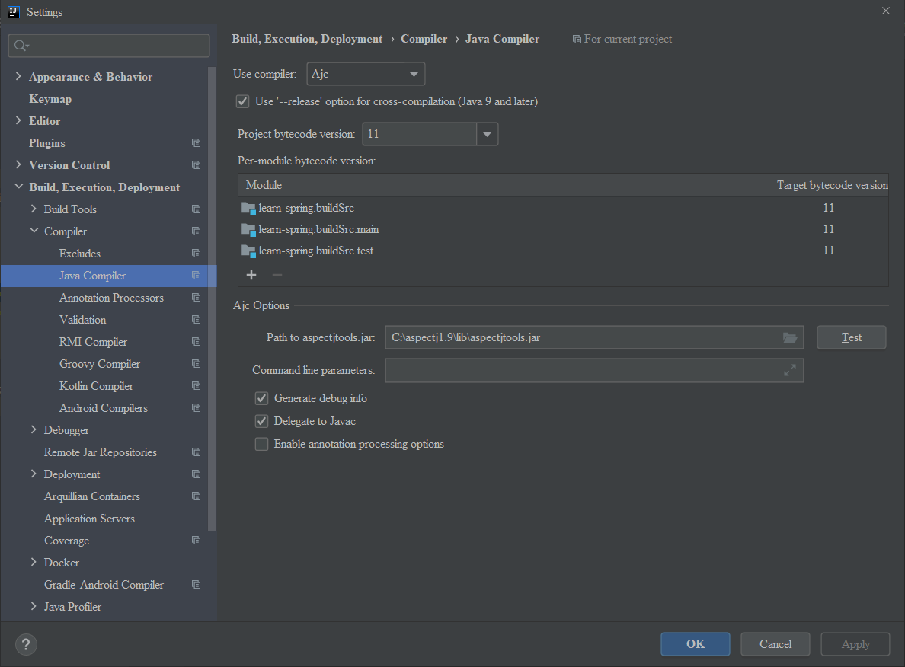

# Spring framework v5.3.5 源码调试环境搭建踩坑点：

- IDEA 2020.3
- JDK 11: https://mirrors.tuna.tsinghua.edu.cn/AdoptOpenJDK/11/jdk/
- spring-core 模块 Tasks/other 应用cglibRepackJar 和 ObjenesisRepackJar
- spring-core 模块下 kotlin-coroutines/build/libs/kotlin-coroutines-5.3.5.jar，右键
  Add as Library
  
- aspectj-1.9.6.jar 安装

  
- File -> Project Structure -> Facets -> + AspectJ 
  应用(spring.spring-aop.main 和 spring.spring-aspects.main)
